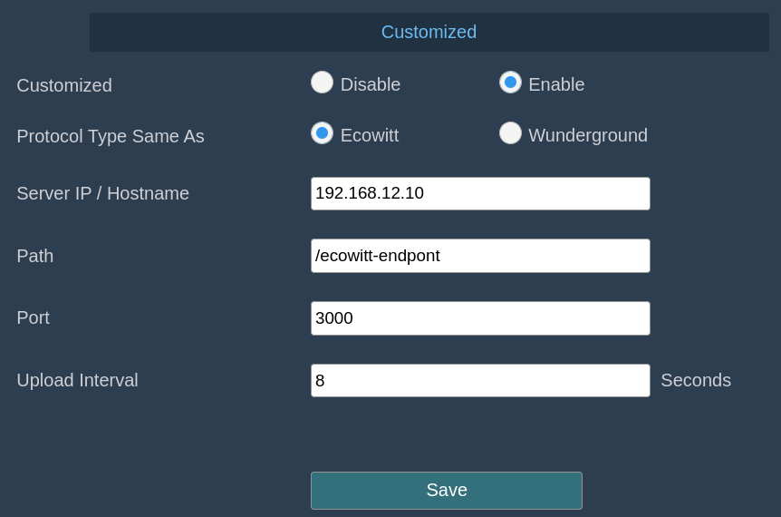

# ecowitt-weather-viewer

Receives data from an Ecowitt weather station and displays stuff

Currently, it's mostly just a wind rose of sorts.

## Requirements

[bun](https://bun.sh) javascript runtime

## Install

`bun install` to install package dependencies

## Run

`bun serve`

On the **Weather Services** pane of the Ecowitt's web page, under the
_Customized_ heading, select _Enable_ and _Ecowitt_, and set appropriate values.
Set _Server IP / Hostname_ to the IP/Hostname this app is running on.
The app's server is on port `3000`. Set the _Upload Interval_ to the minimum of `8`.

